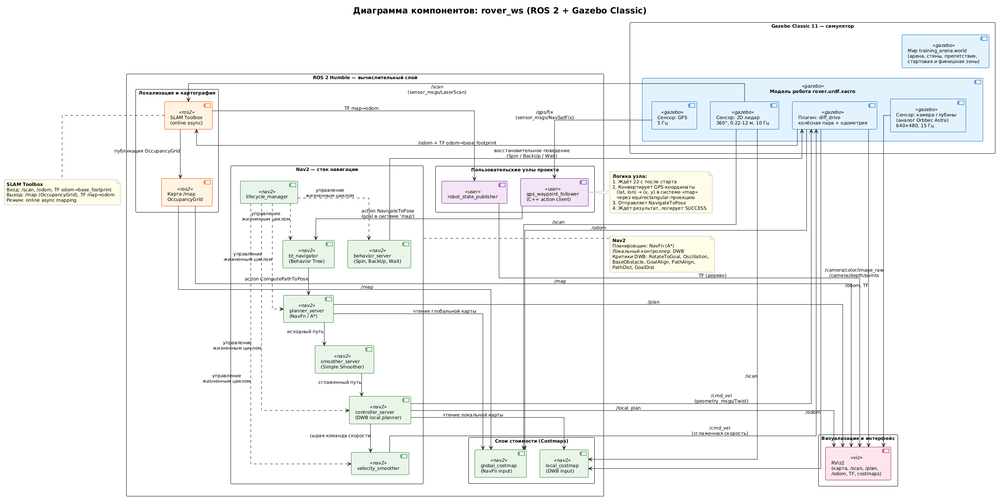

**Стек:** ROS 2 Humble, Gazebo Classic 11, Nav2, SLAM Toolbox, C++.

**ОС:** Fedora (проект также собирается на Ubuntu 22.04).

**Среда управления зависимостями:** [pixi](https://pixi.sh).

Симулированный робот, который проезжает из точки А в точку Б по GPS-координатам, объезжая препятствия, с использованием лидара, камеры глубины (аналог Orbbec Astra) и GPS.

## Требования

- Fedora 40+ или Ubuntu 22.04
- [pixi](https://pixi.sh) — устанавливается одной командой: `curl -fsSL https://pixi.sh/install.sh`

Все зависимости ROS 2, Gazebo и Nav2 устанавливаются автоматически  через pixi при первом запуске. Отдельная установка ROS 2 не требуется.
***
## Демонстрация
)

Робот стартует с точки (`x = -4.25, y = 0`), проезжает через полосу препятствий (блоки, цилиндры, ворота) и финиширует на красной площадке в точке Б (`x = +3.75, y = 0`). GPS-координаты точки Б передаются в Nav2 через action `NavigateToPose`.
***

## Запуск
- Для первого запуска необходимо установить пакетный менеджер pixi, после чего выполнить сборку проекта в терминале: `colcon build --symlink-install`. 
- Для последующего запуска выполните команду активации окружения и старта симуляции: `source install/setup.bash && ros2 launch rover_one full_simulation.launch.py`
Если все успешно, то:
- Если все прошло успешно, на экране откроются два окна: RViz и Gazebo (classic).
- Робот должен автоматически дойти до конечной точки.
- После завершения работы программу можно закрыть в терминале с помощью комбинации клавиш `Ctrl + C`.

##  Архитектура

Архитектура представленна ниже в виде UML диаграммы:

***
## Робот и сенсоры

Модель описана в `src/rover_one/urdf/rover.urdf.xacro`.

| Сенсор                  | Тип        | Плагин Gazebo               | Топик                                                                  | Характеристики                      |
| ----------------------- | ---------- | --------------------------- | ---------------------------------------------------------------------- | ----------------------------------- |
| 2D лидар                | ray        | libgazebo_ros_ray_sensor.so | `/scan`                                                                | 360°, 10 Гц, 0.22–12 м              |
| Камера глубины          | depth      | libgazebo_ros_camera.so     | `/camera/color/image_raw`, `/camera/depth/image_raw`, `/camera/points` | 640x480, 15 Гц, аналог Orbbec Astra |
| GPS                     | gps        | libgazebo_ros_gps_sensor.so | `/gps/fix`                                                             | 5 Гц                                |
| Дифференциальный привод | diff_drive | libgazebo_ros_diff_drive.so | `/cmd_vel`, `/odom`                                                    | Колея 0.34 м, колёса ⌀ 0.16 м       |

**Шасси робота:** 0.4 × 0.3 × 0.1 м, два ведущих колеса + две опорные сферы (спереди и сзади), низкое трение опор (`mu = 0.001`).
***
## Мир Gazebo

Файл: `src/rover_one/worlds/training_arena.world`:
- Прямоугольная площадка 12 × 8 м, окружена стенами
- **Зелёная стартовая площадка** в точке А (`x = -4.25`)
- **Красная финишная площадка** в точке Б (`x = +3.75`)
- 3 оранжевых блока (слалом)
- 2 цилиндра (криволинейные отражения лидара)
- 2 пары узких ворот (проверка проходимости)
- Разметка полосы движения
- `<spherical_coordinates>` задаёт GPS-начало координат

## Навигация

### Nav2 (`config/nav2_params.yaml`)

- **Планировщик:** NavFn (A* по глобальной карте)
- **Локальный контроллер:** DWB с 7 критиками:  
    `RotateToGoal`, `Oscillation`, `BaseObstacle`, `GoalAlign`,  
    `PathAlign`, `PathDist`, `GoalDist`
- **Контроллер частоты:** 10 Гц
- **Goal tolerance:** 0.25 м по XY, 0.25 рад по курсу

### SLAM (`config/slam_toolbox.yaml`)

- Онлайн-асинхронный режим
- Разрешение 0.05 м/пиксель
- Максимальная дальность лидара: 8 м
- Замыкание петель включено
### GPS-навигация

Узел `gps_waypoint_follower` использует упрощённую плоскую проекцию для перевода GPS  в декартовы координаты:
$$ x = (lon − lon₀) · R · cos(lat₀)
y = (lat − lat₀) · R $$

где `R = 6378137 м`. Для дистанций порядка десятков метров  
погрешность мала. Начало координат  (`lat₀ = 55.751244`, `lon₀ = 37.618423`) совпадает с  
`<spherical_coordinates>` в мире.
## Ответы на вопросы:

